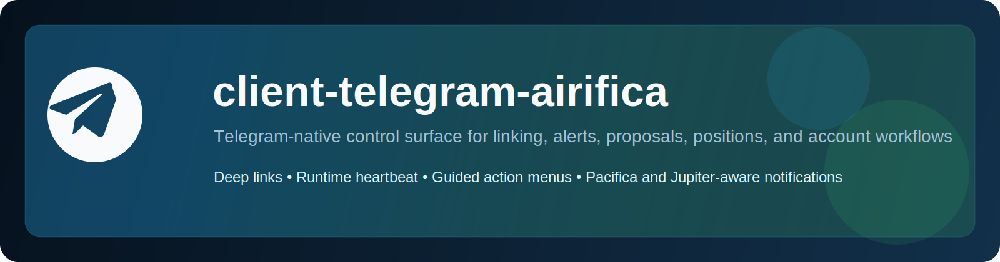

# client-telegram-airifica

<p align="center">
  
</p>

<p align="center">
  <strong>Telegram-native control surface for Airifica trading and account workflows.</strong><br/>
  One-click linking · Alerts · Proposal cards · Positions and history · Runtime analytics
</p>

<p align="center">
  
  
  
  
  
</p>

## Overview

`client-telegram-airifica` is the Telegram client used by Airifica runtimes.

It turns Telegram into a first-class product surface, not a notification appendage:

- account linking via deep links and one-click codes
- alerts for Pacifica and Jupiter-linked spot flows
- Telegram-native action menus
- positions, history, and account panels
- proposal rendering and trading controls
- runtime heartbeat and analytics events back into `client-airifica`

## Features

| Area | Details |
|---|---|
| Linking | Deep-link wallet ↔ Telegram association with fallback code flow |
| Actions | Guided actions for chart, price, analysis, news, sentiment, volume, listings, and more |
| Proposal cards | Pacifica-native proposal controls and Jupiter handoff flows |
| Position control | Compact position panels, refresh actions, and close / partial-close controls |
| Alerts | Runtime-driven notifications for trade opens, closes, spot handoff, and execution status |
| Home panels | User-friendly home, positions, history, help, and settings panels |
| Runtime analytics | Command, action, and heartbeat tracking through internal runtime APIs |

## Architecture

```text
Telegram User
    │
    ▼
Telegram Bot API
    │
    ▼
client-telegram-airifica
  ├── long-poll update loop
  ├── command and callback router
  ├── proposal draft store
  ├── pending action input state
  └── internal API client
          │
          ▼
client-airifica runtime
  ├── link codes
  ├── positions / history / account data
  ├── alert outbox
  ├── runtime heartbeat
  └── wallet-scoped analytics
```

## Project Structure

```text
client-telegram-airifica/
├── src/
│   ├── index.ts
│   └── telegramClient.ts
├── docs/
│   ├── architecture.md
│   ├── operations.md
│   ├── setup.md
│   └── media/
├── .env.example
├── package.json
├── tsconfig.json
└── tsup.config.ts
```

## Requirements

- Node.js `23.x`
- `pnpm`
- a Telegram bot token from `@BotFather`
- a running `client-airifica` runtime exposing internal Telegram routes

## Quick Start

```bash
git clone git@github.com:0xfunboy/client-telegram-airifica.git
cd client-telegram-airifica
pnpm install
cp .env.example .env
pnpm build
```

This package expects a live Airifica runtime to exist behind `AIRI3_TELEGRAM_RUNTIME_BASE_URL`.

## Runtime Contract

The Telegram client expects these internal capabilities from `client-airifica`:

- link code creation and resolve
- chat status lookup
- positions / account / history endpoints
- alert outbox polling
- heartbeat endpoint
- analytics event endpoint

## Documentation

| Document | Description |
|---|---|
| [Setup](docs/setup.md) | Install, env setup, and start-up requirements |
| [Architecture](docs/architecture.md) | Runtime blocks, callback model, and state ownership |
| [Operations](docs/operations.md) | Production notes, health checks, and troubleshooting |

## License

MIT
